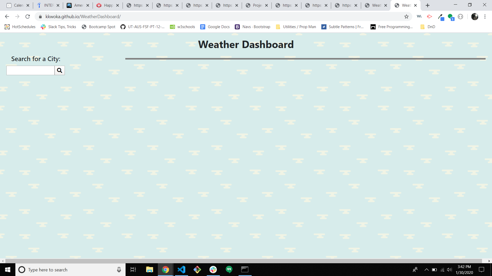
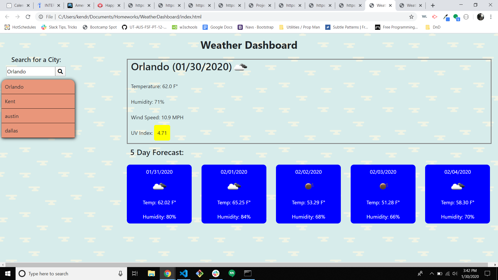
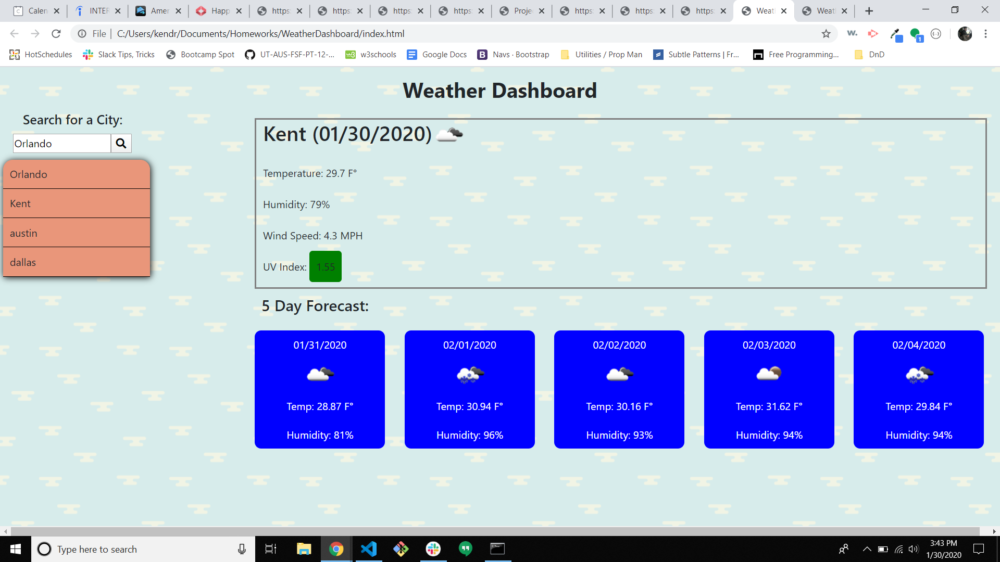

# WeatherDashboard
This page will allow the user to search for a city within the United States. Once they search for a city, it will update a list of saved searches. When the user clicks on one of the cities on that search list, they will be shown the current and future weather for that given city.

## Deployment Link
https://kkwoka.github.io/WeatherDashboard/

## Included Files
* index.html
* README.md
* Assets/
    * script.js
    * style.css
    * Assets/Images
        * cloudy-day.png
        * One.png
        * Two.png
        * Three.png

## Resources
* Bootstrap
* JQuery
* FontAwesome
* AJAX

## Images of Working Password Generator

