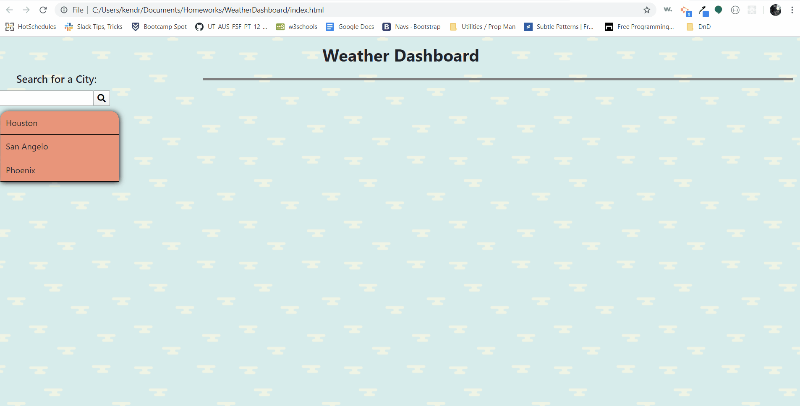

# WeatherDashboard
This page will allow the user to search for a city within the United States. Once they search for a city, it will update a list of saved searches. When the user clicks on one of the cities on that search list, they will be shown the current and future weather for that given city.

## Deployment Link
https://kkwoka.github.io/WeatherDashboard/

## Table of Contents 
* [Resources](#Resources)

* [Files](#Files)
​
* [GIF](#GIF)
​  ​
* [Questions](#questions)

## Resources
    * Bootstrap
    * JQuery
    * FontAwesome
    * AJAX

## Files
    * index.html
    * README.md
    * Assets/
        * script.js
        * style.css
        * Assets/Images
            * cloudy-day.png
            * One.png
            * Two.png
            * Three.png

## GIF

## Questions
​

​
If you have any questions about the repo, contact [kkwoka](https://github.com/kkwoka).
